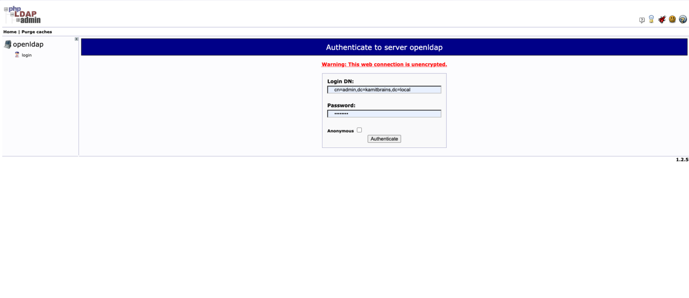
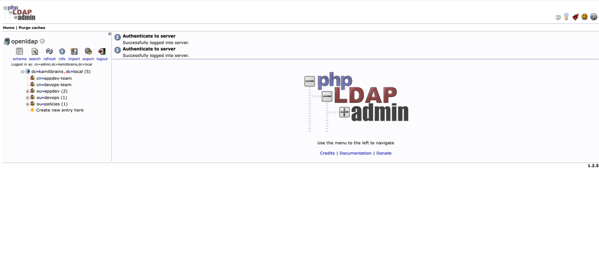

# OpenLDAP + phpLDAPadmin

This stack provides an **OpenLDAP** directory server alongside **phpLDAPadmin**, a web-based GUI for managing LDAP entries.

## Quick Start

1. Start the stack:
   ```bash
   cp .env.example .env
   cp -r .secrets.example .secrets
   docker network create traefik-public   # Once, if Traefik isn't already running
   docker compose up -d
   ```

2. Access **phpLDAPadmin**:
   - Local HTTP: `http://localhost:8088`
   - Traefik HTTPS: `https://ldap.kamitbrains.local` (or your configured `PHPLDAPADMIN_HOSTNAME`)

   > ⚠️ **Note:** phpLDAPadmin requires the full **Login DN**, not just a username.

   

   Passwords come from the files in `.secrets/`; the values below are the defaults from `.secrets.example/`.

   - **Admin Login:**
     - **Login DN:** `cn=admin,dc=kamitbrains,dc=local` (or your configured `LDAP_BASE_DN`)
     - **Password:** `password` (`.secrets/ldap_admin_password.txt`)
   - **User Login (e.g. Aurelien):**
     - **Login DN:** `cn=aurelien,ou=devops,dc=kamitbrains,dc=local`
     - **Password:** `Aurelien@123` (`.secrets/user_aurelien_password.txt`)
     *(In services querying via `uid` like Nextcloud, Keycloak, etc., use `nkaurelien`).*

## Auto-initialization

When you launch `docker compose up -d`, a temporary `init-ldap` container is automatically started.
It waits for OpenLDAP to be healthy and then runs `scripts/init.sh` to automatically populate the database with:

1. **OUs**: `ou=devops` and `ou=appdev`.
2. **Users**: `cn=aurelien` (uid `nkaurelien`, devops), `cn=idriss` (uid `nnid`, appdev) and `cn=michel` (uid `edmich`, appdev), with `{SSHA}`-hashed passwords.
3. **memberOf overlay**: Reconfigured to track `groupOfNames`/`member` (osixia defaults to `groupOfUniqueNames`/`uniqueMember`).
4. **Groups**: `appdev-team` (aurelien, idriss) and `devops-team` (aurelien, michel). The overlay maintains `memberOf` on users automatically.
5. **ACLs**: Grants read access to `cn=aurelien`.
6. **Password policy**: Loads and attaches the `ppolicy` overlay, then creates `cn=default,ou=policies`.

The script is idempotent: "already exists" results (LDAP codes 68 and 20) are treated as success, and the `ppolicy` overlay is only attached if missing. It exits non-zero if a secret is missing/empty or if any real LDAP error occurs. To re-run it:
```bash
docker compose up -d --force-recreate init-ldap
docker logs init-ldap
```

Once logged in as admin, the directory tree shows the groups, OUs and the password policy container:



### Verifying access
You can verify that the user `cn=aurelien` has access by running an LDAP search from your host (if you have ldap-utils installed) or from inside the container:
```bash
docker exec -it openldap ldapsearch -x -D "cn=aurelien,ou=devops,dc=kamitbrains,dc=local" -w Aurelien@123 -b "dc=kamitbrains,dc=local"
```

## Directory Structure & LDAP Objects

```text
dc=kamitbrains,dc=local (Domain Root / Base DN)
 │
 ├── cn=appdev-team        [groupOfNames]
 ├── cn=devops-team        [groupOfNames]
 │
 ├── ou=devops             [organizationalUnit]
 │    └── cn=aurelien      [inetOrgPerson] (uid: nkaurelien)
 │
 └── ou=appdev             [organizationalUnit]
      ├── cn=idriss        [inetOrgPerson] (uid: nnid)
      └── cn=michel        [inetOrgPerson] (uid: edmich)
```

### Key LDAP Concepts:
- **`dcObject` / `organization`**: The root of your directory tree (Base DN).
- **`organizationalUnit` (OU)**: Folder-like container used to organize entries logically.
- **`inetOrgPerson`**: Standard object class representing a human user (supports `cn`, `sn`, `uid`, `mail`, `userPassword`).
- **`groupOfNames`**: Group containing references to its members (`member: <full DN>`).
- **`memberOf`**: Reverse-membership attribute on users, computed by the `memberof` overlay from each group's `member` values (never written by hand).

## Security & Hardening

### 1. Password Hashing ({SSHA})
Passwords are **never stored in cleartext**. The bootstrap script hashes user passwords with `slappasswd` using salted SHA-1 (`{SSHA}`) before inserting them into the LDAP directory. `{SSHA}` is a fast hash, fine for a lab; for production prefer a slow hash such as Argon2 (`pw-argon2` module).
- Generated value format: `{SSHA}hSJamTTdc8MudXG9O2Bw5pq6uifvPrdC`
- Password verification is performed by matching the salt and hash, keeping cleartext credentials confidential.

### 2. Privilege Separation (Dual Secret Architecture)
Two distinct administrator passwords are configured via **Docker Compose Secrets**:
- **`ldap_admin_password`** (`cn=admin,dc=kamitbrains,dc=local`): Directory administrator (manages users, OUs, and groups).
- **`ldap_config_password`** (`cn=admin,cn=config`): Low-level OpenLDAP engine administrator (schemas, modules, ACLs).

This prevents directory data managers from modifying the server's runtime configuration.

### 3. Password Policy Overlay (`ppolicy`) & Brute-force Protection
The OpenLDAP **`ppolicy`** overlay is enabled and enforced globally (`cn=default,ou=policies,dc=kamitbrains,dc=local`):
- **Quality Checking (`pwdCheckQuality: 1`)**: Required for `pwdMinLength` to be enforced at all.
- **Minimum Password Length (`pwdMinLength`)**: 8 characters.
- **Account Lockout (`pwdLockout`)**: Enabled (`TRUE`).
- **Max Failed Attempts (`pwdMaxFailure`)**: 5 failed login attempts.
- **Lockout Duration (`pwdLockoutDuration`)**: 900 seconds (15 minutes).
- **Failure Counting Window (`pwdFailureCountInterval`)**: 900 seconds.
- **Auto-Hashing (`olcPPolicyHashCleartext`)**: Automatically converts cleartext password modifications to secure hashes.

> The policy does not apply to the root DN (`cn=admin,...`), which bypasses ppolicy.

## Production Notes
- **TLS**: Prefer LDAPS (`636`) or StartTLS on `389`; the osixia image ships a self-signed certificate by default.
- **Traefik certificates**: Let's Encrypt cannot issue certificates for `.local` names. Use a real domain (DNS challenge for internal hosts) or accept Traefik's default self-signed certificate in a lab.
- **Secrets**: Replace every file in `.secrets/` with unique, strong passwords before deploying.

## References & Documentation
- [osixia/container-openldap (GitHub Repository)](https://github.com/osixia/container-openldap)
- [Setting up OpenLDAP Server with Docker (Medium Guide by Amrutha)](https://medium.com/@amrutha_20595/setting-up-openldap-server-with-docker-d38781c259b2)
