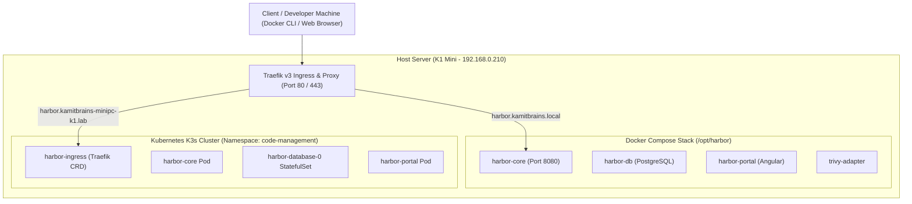

# Dual-Stack Container Registry Architecture: Harbor on Docker Compose & Kubernetes K3s with Traefik Ingress

*By nkaurelien — Cloud-Native Infrastructure & Networking Guide*

---

## Overview

Modern homelab environments and hybrid cloud infrastructure often maintain dual deployment targets: a lightweight **Docker Compose** stack managed via Ansible for host-level services, and a **Kubernetes (K3s)** cluster for containerized workloads.

When running **Harbor OCI Registry** across both targets behind a unified **Traefik v3** reverse proxy, routing conflicts and storage isolation require precise configuration. This article provides a comprehensive blueprint for orchestrating dual-stack Harbor deployments.

---

## Architecture Diagram



---

## 1. Docker Compose & Ansible Setup (`/opt/harbor`)

The host-level deployment utilizes Harbor's online installer template managed via Ansible.

### Traefik v3 Docker Compose Override Template

To route traffic cleanly without port collisions:

```yaml
# ansible/roles/harbor/templates/docker-compose.override.yml.j2
services:
  proxy:
    networks:
      - traefik-public
      - harbor
    labels:
      - "traefik.enable=true"
      - "traefik.docker.network=traefik-public"
      # HTTPS Router
      - "traefik.http.routers.harbor.rule=Host(`harbor.kamitbrains-minipc-k1.lab`) || Host(`harbor.kamitbrains.local`) || Host(`harbor.kamitbrains.fr`)"
      - "traefik.http.routers.harbor.entrypoints=websecure"
      - "traefik.http.routers.harbor.tls=true"
      - "traefik.http.services.harbor.loadbalancer.server.port=8080"
```

---

## 2. Kubernetes K3s Deployment (`helm/values/harbor/values.yaml`)

In Kubernetes, Harbor is managed via the official Helm chart (`harbor/harbor`) with customized PVC allocations using `local-path` storage class.

### Key Helm Values Configuration

```yaml
expose:
  type: ingress
  tls:
    enabled: true
    certSource: none
  ingress:
    hosts:
      core: harbor.kamitbrains-minipc-k1.lab
    controller: default
    className: traefik
    annotations:
      cert-manager.io/cluster-issuer: homelab-ca-issuer
      traefik.ingress.kubernetes.io/router.entrypoints: websecure

externalURL: https://harbor.kamitbrains-minipc-k1.lab

persistence:
  enabled: true
  resourcePolicy: keep
  persistentVolumeClaim:
    registry:
      storageClass: "local-path"
      size: 50Gi
    database:
      storageClass: "local-path"
      size: 10Gi
    trivy:
      storageClass: "local-path"
      size: 5Gi

trivy:
  enabled: true
```

---

## 3. Avoiding Host & Ingress Routing Collisions

When running both Docker Compose and K3s Traefik ingress on the same IP (`192.168.0.210`):

1. **Explicit Host Assignment**: Assign distinct domain aliases for debugging if necessary (e.g., `harbor-dc.kamitbrains.local` for Compose vs `harbor.kamitbrains-minipc-k1.lab` for K3s).
2. **Database Isolation**: Ensure persistence volumes (`/opt/harbor/data` vs K3s PVC `local-path-storage`) remain independent.
3. **Registry Mirroring**: Use Harbor’s native replication rules to automatically sync images between host registry and K3s cluster registry.

---

## 4. Verification & Testing

Verify that both API endpoints are operational:

```bash
# Test OCI Distribution API v2 Endpoint
curl -u "admin:1Q2f316jbcXE2drG94z0qlE4" -sk https://harbor.kamitbrains-minipc-k1.lab/v2/_catalog

# Push a test image to the OCI registry
docker tag alpine:latest harbor.kamitbrains-minipc-k1.lab/library/alpine:latest
docker push harbor.kamitbrains-minipc-k1.lab/library/alpine:latest
```
