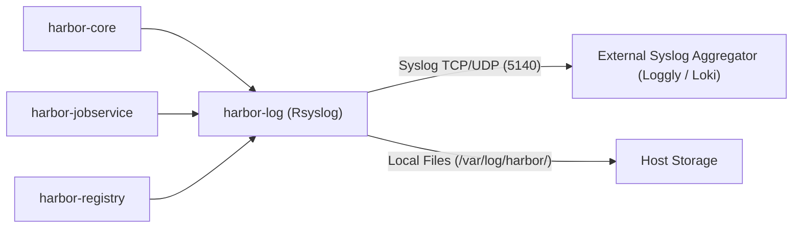

# Enterprise Container Logging: Forwarding Harbor & Microservices Syslog Streams to External Aggregators

*By nkaurelien — Site Reliability Engineering & Observability Guide*

---

## Overview

In production microservices environments, centralized log aggregation is essential for auditing, compliance, security monitoring, and troubleshooting. **Harbor** generates rich audit logs covering image pushes, pulls, vulnerability scan reports, and authentication attempts.

This article details how to configure Harbor’s native syslog component (`harbor-log`) and Docker container logging to stream real-time logs to cloud aggregators such as **SolarWinds Loggly**, **Datadog**, or an in-house **Grafana Loki / ELK** stack.

---

## Log Architecture in Harbor

Harbor routes internal container logs through a dedicated `harbor-log` sidecar container running **Rsyslog**:



---

## 1. Native Harbor External Endpoint Configuration (`harbor.yml`)

Harbor provides a built-in `external_endpoint` setting in `harbor.yml` to automatically forward log streams over TCP or UDP:

```yaml
# Harbor Log Configuration
log:
  level: info
  local:
    rotate_count: 50
    rotate_size: 200M
    location: /var/log/harbor

  # External Syslog forwarding to Loggly
  external_endpoint:
    protocol: tcp
    host: logs-01.loggly.com
    port: 514
```

When activated, `harbor-log` formats all internal component logs into standard RFC 5424 syslog messages and transmits them to the remote endpoint.

---

## 2. Direct Container Syslog Forwarding with Docker Daemon

For a comprehensive observability setup where **all homelab containers** (Traefik, CrowdSec, K3s, Harbor) stream logs to Loggly:

### Docker Daemon Configuration (`/etc/docker/daemon.json`)

```json
{
  "log-driver": "syslog",
  "log-opts": {
    "syslog-address": "tcp+tls://logs-01.loggly.com:6514",
    "syslog-format": "rfc5424",
    "tag": "homelab/{{.Name}}/{{.ID}}"
  }
}
```

---

## 3. Loggly Token Tagging via Rsyslog (`rsyslog_docker.conf`)

Loggly identifies log streams using customer tokens. In Harbor’s `harbor-log` container, custom headers can be injected into `/etc/rsyslog.d/` templates:

```rsyslog
# /etc/rsyslog.d/loggly.conf
$template LogglyFormat,"<%pri%>%protocol-version% %timestamp:::date-rfc3339% %HOSTNAME% %app-name% %procid% %msgid% [YOUR_LOGGLY_TOKEN@41414 tag=\"harbor\"] %msg%\n"

*.* @@logs-01.loggly.com:514;LogglyFormat
```

---

## 4. Monitoring & Alerting on Security Events

Once log streams reach Loggly or Grafana Loki, set up automated alerts for security events:

### Key Audit Patterns to Monitor

1. **Failed Login Spikes** (`"Failed to authenticate user"`): Indicates brute-force attacks against the `admin` or robot accounts.
2. **High-Severity Vulnerability Detection** (`"CVE-"` & `"SEVERITY: CRITICAL"`): Detects vulnerable container images uploaded to private repositories.
3. **Repository Deletion Events** (`"delete repository"`): Audits administrative asset purges.

---

## 5. Conclusion

Centralizing Harbor's audit and operational logs provides total visibility into your container supply chain. Whether using native `external_endpoint` in `harbor.yml` or host-level Docker syslog drivers, real-time log streaming ensures operational resilience and SecOps compliance.
