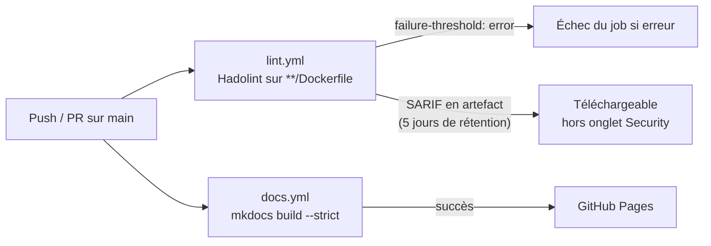
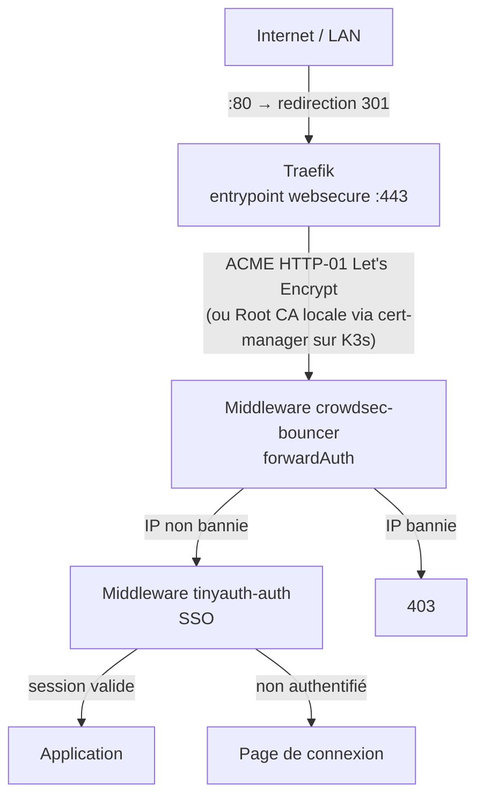
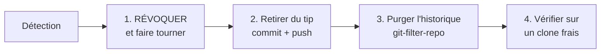

# Posture DevSecOps : Pipeline et Mesures de Sécurité

Cette page décrit **l'état réel** de la chaîne CI/CD et des mesures de sécurité de ce
dépôt et des hôtes qu'il déploie. Elle distingue explicitement ce qui est **en place**
de ce qui est **documenté mais non implémenté**, et chiffre la couverture réelle.

Elle est vérifiable : chaque affirmation renvoie à un fichier du dépôt ou à une
commande d'inspection.

!!! warning "Pourquoi cette page existe"
    Le 13 septembre 2026, un guide de purge de secrets a été commité avec, dans sa
    table de remplacement, les secrets en clair qu'il documentait comme purgés.
    Ils sont restés publics sept jours. L'audit qui a suivi en a révélé cinq autres,
    dont une clé d'API dans les defaults d'un rôle Ansible — dix identifiants au total.

    Aucune de ces fuites n'a été détectée par la CI, pour une raison simple : **il n'y
    a aucun scan de secrets dans la CI**. C'est la lacune numéro un de cette posture,
    et elle est documentée ci-dessous plutôt que passée sous silence.

---

## 1. Ce que la CI vérifie aujourd'hui

Deux workflows GitHub Actions, et rien d'autre.



### `lint.yml` — Hadolint

| Paramètre | Valeur | Effet |
| :--- | :--- | :--- |
| `recursive` | `true` | Tous les `Dockerfile` du dépôt |
| `failure-threshold` | `error` | Bloque sur `error`, laisse passer `warning` |
| `ignore` | `DL3008`, `DL3013`, `DL3018`, `DL3059` | Épinglage de versions apt/pip/apk non exigé |
| `format` | `sarif` | Rapport structuré |
| Rapport | `upload-artifact`, 5 jours | **Artefact**, pas *code scanning* |

!!! note "Le SARIF n'atteint pas l'onglet Security"
    Le rapport est publié via `actions/upload-artifact`. Pour qu'il alimente
    l'onglet *Security* de GitHub — annotations dans les PR, historique, suivi de
    résolution — il faudrait `github/codeql-action/upload-sarif`. En l'état, il faut
    télécharger l'artefact pour le lire, ce que personne ne fait en pratique.

### `docs.yml` — Publication de la documentation

`mkdocs build --strict` puis déploiement sur GitHub Pages. Le `--strict` a une valeur
défensive réelle : il échoue sur un lien interne cassé ou une page hors nav, ce qui
évite de publier une documentation incohérente.

### Ce qui n'est **pas** dans la CI

| Contrôle absent | Conséquence concrète |
| :--- | :--- |
| **Scan de secrets** (TruffleHog, Gitleaks) | Dix identifiants publiés, détectés à la main sept jours plus tard |
| **Scan de vulnérabilités d'images** (Trivy) | Aucune visibilité sur les CVE des images déployées |
| **Lint Ansible** (`ansible-lint`) | Les erreurs de rôle se découvrent au déploiement |
| **Hook de pré-commit** | Aucune barrière locale ; tout se joue après le push |
| **Remontée SARIF au code scanning** | Les résultats Hadolint ne sont pas exploitables |

---

## 2. Défense en profondeur à l'exécution

C'est là que la posture est la plus solide. Le trafic entrant traverse quatre couches
avant d'atteindre une application.



### Couche 1 — TLS systématique

Défini dans `ansible/roles/traefik/templates/docker-compose.yml.j2` :

```yaml
- "--entrypoints.web.http.redirections.entrypoint.to=websecure"
- "--entrypoints.web.http.redirections.entrypoint.scheme=https"
- "--certificatesresolvers.letsencrypt.acme.httpchallenge=true"
```

Le port 80 ne sert qu'à la redirection et au challenge ACME. Sur le cluster K3s, les
certificats proviennent d'une **Root CA locale** (`mkcert` + `cert-manager`,
ClusterIssuer `homelab-ca-issuer`), ce qui évite les avertissements de navigateur sur
les domaines `.lab` non routables publiquement.

### Couche 2 — CrowdSec

`ansible/roles/traefik/templates/traefik-crowdsec-middleware.yml.j2` :

```yaml
http:
  middlewares:
    crowdsec-bouncer:
      forwardAuth:
        address: "http://crowdsec-traefik-bouncer:8080/api/v1/forwardAuth"
        trustForwardHeader: true
```

Chaque requête est soumise au bouncer avant routage. CrowdSec analyse les logs Traefik
et bannit les IP sur comportement (bruteforce, scan, exploitation de CVE connues).

### Couche 3 — tinyauth (SSO)

Middleware `tinyauth-auth@docker` appliqué par label sur les services internes. Les
identifiants sont chargés depuis `.secrets/` par `lookup('file', ...)` — aucun mot de
passe dans les defaults du rôle.

### Couche 4 — Dashboard Traefik en Basic Auth

`traefik-dashboard-auth.yml.j2` protège le dashboard par `basicAuth` avec une entrée
htpasswd injectée depuis `.secrets/`.

---

## 3. Isolation du socket Docker

**Aucun conteneur applicatif ne monte `/var/run/docker.sock`.** Chaque service qui a
besoin de l'API Docker passe par son propre proxy filtrant
(`tecnativa/docker-socket-proxy`), sur un réseau `internal: true`.

Proxies actuellement déployés : `traefik-socket-proxy`, `homepage-socket-proxy`,
`ofelia-socket-proxy`, `glances-socket-proxy`, `arcane-docker-proxy`.

!!! danger "Le `:ro` sur le socket ne protège de rien"
    `/var/run/docker.sock` est un point d'entrée d'API, pas un fichier de données. Le
    drapeau `:ro` empêche d'écraser la socket, mais **n'a aucun effet sur les requêtes
    qui la traversent**. Un conteneur y ayant accès peut créer un conteneur privilégié
    montant `/` et obtenir un shell root sur l'hôte. C'est une permission
    d'administration, pas un volume.

Matrice de moindre privilège par service : voir
[Socket Proxy Permissions](../reference/socket-proxy-permissions.md).

La moitié des consommateurs n'écrit jamais — Traefik, Homepage et Glances tournent
avec `POST=0`, ce qui neutralise complètement le vecteur d'évasion.

### Les permissions « inutiles » qui ne le sont pas

`PING`, `VERSION`, `INFO` et `EVENTS` paraissent superflues. Elles sont en réalité un
prérequis : le client Docker les appelle à la connexion pour négocier la version de
l'API. Sans elles, la poignée de main échoue avant toute requête utile, et le service
démarre en affichant des widgets vides sans message d'erreur explicite.

Durcissez avec `LOG_LEVEL=info` : chaque route refusée apparaît en `403` dans les logs
du proxy. C'est plus rapide que de deviner.

---

## 4. Durcissement des conteneurs — couverture réelle

Sur les **37 stacks Ansible** du dépôt :

| Directive | Stacks couvertes | Taux |
| :--- | ---: | ---: |
| `healthcheck` | 31 | **84 %** |
| Réseau `internal: true` | 6 | 16 % |
| `security_opt: no-new-privileges` | 5 | 14 % |
| `read_only: true` | 4 | 11 % |
| `cap_drop: ALL` | 4 | 11 % |
| `user:` non-root explicite | 1 | 3 % |

Les `healthcheck` sont quasi généralisés — c'est la mesure la mieux adoptée, et elle
porte : couplée à `depends_on: condition: service_healthy`, elle évite les démarrages
en cascade sur un service pas encore prêt.

Le durcissement au sens strict (`read_only`, `cap_drop`, `no-new-privileges`) reste
concentré sur les **socket-proxies**, c'est-à-dire précisément les conteneurs qui
concentrent le privilège. Le raisonnement est défendable, mais la couverture de 11 %
sur le reste du parc est une marge de progression identifiée.

Exemple de référence, `homepage-socket-proxy` :

```yaml
read_only: true
tmpfs:
  - /run
  - /tmp
security_opt:
  - no-new-privileges:true
cap_drop:
  - ALL
```

!!! tip "`read_only: true` impose `tmpfs`"
    HAProxy écrit sa socket runtime dans `/run` et ses fichiers temporaires dans
    `/tmp`. Oublier l'un des deux produit un conteneur qui redémarre en boucle, sans
    message explicite.

---

## 5. Gestion des secrets

### Principe

Aucune valeur sensible dans un fichier versionné. Les secrets vivent dans `.secrets/`,
exclu par `.gitignore` :

```gitignore
.secrets/*
!.secrets/*.md
*.csv
*.pem
*.key
```

Les rôles Ansible les lisent à l'exécution :

```yaml
forgejo_admin_password: "{{ lookup('file', playbook_dir ~ '/../.secrets/forgejo-admin-password') | trim }}"
```

Sur Kubernetes, l'équivalent est `valueFrom.secretKeyRef` ou `envFrom.secretRef`, le
Secret étant créé hors dépôt :

```bash
kubectl create secret generic infisical-secrets \
  --from-env-file=.secrets/infisical.env -n security
```

!!! warning "L'exception `!.secrets/*.md`"
    Les fichiers `.md` de `.secrets/` **sont versionnés** : ils documentent où trouver
    chaque identifiant. Ils ne doivent contenir que des **références de chemin**, jamais
    de valeur :

    ```markdown
    - **Admin Password File**: `.secrets/forgejo-admin-password`   ← correct
    - **Password**: `M0nMotDeP@sse`                                ← fuite
    ```

    Quatre des dix fuites de septembre 2026 venaient exactement de là.

### Rotation

Les rôles utilisent les commandes de **création** de compte — `forgejo admin user
create`, `manage_users --add`, `createsuperuser`, `firstOrCreate()`. Elles sont sans
effet sur un compte existant : **rejouer `site.yml` ne rotate aucun mot de passe**.

D'où un playbook dédié, `ansible/rotate-secrets.yml`, qui emploie les commandes de
*changement*, sans recréer de conteneur ni supprimer de volume :

```bash
# 1. Régénérer la valeur dans .secrets/<service>-...
# 2. Appliquer
ansible-playbook -i ansible/inventory.yml ansible/rotate-secrets.yml
# 3. Mettre à jour le coffre Passbolt
```

| Service | Commande employée | Données |
| :--- | :--- | :--- |
| Forgejo | `forgejo admin user change-password` | préservées |
| HedgeDoc | `manage_users --pass X --reset <email>` | préservées |
| GlitchTip | Django `set_password()` | préservées |
| Databasement | Laravel `forceFill` + `save()` | préservées |
| Gotify | hash bcrypt écrit dans SQLite | préservées |
| Portabase | `ALTER USER` + redéploiement | préservées |

### Coffre

**Passbolt** est déployé sur les deux hôtes et fait référence. `.secrets/` est le
support d'exécution, Passbolt le support humain. Les deux doivent être mis à jour
après une rotation.

---

## 6. Ce qui est déployé, et ce qui ne l'est pas

Distinction importante : le dépôt documente plus de solutions qu'il n'en exécute.

| Composant | Documenté | Déployé |
| :--- | :---: | :---: |
| Traefik (TLS, redirection) | ✅ | ✅ les 2 hôtes |
| CrowdSec + bouncer Traefik | ✅ | ✅ les 2 hôtes |
| tinyauth (SSO) | ✅ | ✅ les 2 hôtes |
| Docker socket proxies | ✅ | ✅ 4 à 5 instances par hôte |
| Passbolt (coffre) | ✅ | ✅ les 2 hôtes |
| Glances (supervision) | ✅ | ✅ les 2 hôtes |
| Infisical (secrets K8s) | ✅ | ✅ cluster K3s |
| **Wazuh** (SIEM/HIDS) | ✅ | ❌ |
| **NeuVector** (sécurité conteneurs) | ✅ | ❌ |
| **ClamAV** (antivirus) | ✅ | ❌ |

Vérification :

```bash
ansible docker_hosts -i ansible/inventory.yml -m shell \
  -a "docker ps --format '{{ '{{' }}.Names{{ '}}' }}' | sort"
```

---

## 7. Lacunes connues et priorités

Classées par rapport valeur / effort, la première ayant un incident réel à son actif.

### P1 — Scan de secrets en CI

C'est la lacune qui a coûté sept jours d'exposition publique.

```yaml
# .github/workflows/security.yml
secrets-scan:
  runs-on: ubuntu-latest
  steps:
    - uses: actions/checkout@v4
      with: { fetch-depth: 0 }   # l'historique complet, pas seulement le dernier commit
    - uses: trufflesecurity/trufflehog@main
      with:
        extra_args: --only-verified --fail
```

`--only-verified` tente d'authentifier chaque candidat auprès du service concerné. Sans
cette option, un dépôt un peu ancien produit des centaines de faux positifs et le job
finit désarmé — c'est-à-dire inutile.

### P2 — Hook de pré-commit

Seule barrière qui agit **avant** que le secret n'existe dans un commit :

```yaml
# .pre-commit-config.yaml
repos:
  - repo: https://github.com/gitleaks/gitleaks
    rev: v8.21.2
    hooks:
      - id: gitleaks
```

### P3 — Remonter le SARIF Hadolint au code scanning

Une ligne à changer dans `lint.yml` pour rendre exploitables des résultats déjà produits :

```yaml
- uses: github/codeql-action/upload-sarif@v3
  with:
    sarif_file: hadolint-results.sarif
```

### P4 — Scan de vulnérabilités d'images

Voir [Security Scanning](security-scanning.md). Le réglage qui rend le blocage
soutenable dans la durée :

```bash
trivy image --exit-code 1 --severity CRITICAL --ignore-unfixed "$IMAGE"
```

`--ignore-unfixed` est déterminant : une CVE sans correctif publié n'appelle aucune
action, la signaler bloque le pipeline sans offrir de solution. C'est la première
cause d'ajout d'un `allow_failure: true` qui neutralise la barrière.

!!! danger "`trivy image` sort en code 0 par défaut"
    Sans `--exit-code 1`, Trivy affiche ses résultats et **termine en succès**, même en
    trouvant des vulnérabilités critiques. Le job apparaît vert quoi qu'il arrive.

### P5 — Étendre le durcissement au-delà des socket-proxies

Porter `no-new-privileges`, `cap_drop: ALL` et `user:` non-root sur les stacks
applicatives, au-delà des 11 % actuels.

---

## 8. Réagir à une fuite d'identifiant

L'ordre est contre-intuitif et il compte.



1. **Révoquer d'abord.** Une purge d'historique ne dé-compromet rien. Si le dépôt a été
   public une minute, supposez la collecte : les robots surveillent le flux
   d'événements GitHub en temps réel.
2. **Retirer du tip**, y compris du site généré s'il publie le fichier — le HTML publié
   est un canal d'exposition distinct de l'historique Git, et indexable.
3. **Purger l'historique** avec `git-filter-repo` (`filter-branch` est déconseillé par
   Git). Procédure détaillée :
   [Purge des secrets Git](../services/security/purging-git-secrets.md).
4. **Vérifier sur un clone frais** depuis la forge, pas sur le dépôt local.

!!! caution "Deux pièges de la purge"
    - **La table de motifs est un inventaire de secrets.** Elle vit dans `/tmp`, se
      détruit au `shred`, et ne se documente jamais avec ses valeurs.
    - **Les formes tronquées survivent.** Une règle `literal:` sur le mot de passe
      complet ne touche pas un fragment présent ailleurs — par exemple dans un exemple
      de commande. Énumérez les variantes avant de réécrire, sous peine d'une seconde
      passe et d'un second `--force-push`.

---

## Références internes

- [Socket Proxy Permissions](../reference/socket-proxy-permissions.md) — matrice par service
- [Docker Socket Proxy](../services/security/socket-proxy.md) — mise en place
- [Docker Capabilities](../docker/capabilities.md) — `privileged` vs capabilities
- [Security Scanning](security-scanning.md) — Trivy, TruffleHog, Hadolint, Semgrep
- [Purge des secrets Git](../services/security/purging-git-secrets.md) — remédiation
- [Sécurité — Vue d'ensemble](../services/security/index.md)
