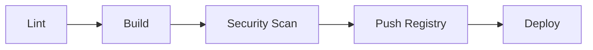

# Intégration Continue Docker

Guide pour intégrer Docker dans vos pipelines CI/CD.

## Plateformes supportées

| Plateforme | Documentation |
|------------|---------------|
| [GitLab CI](gitlab-ci.md) | Build, push et déploiement avec GitLab |
| [GitHub Actions](github-actions.md) | Workflows Docker pour GitHub |

## Concepts clés

### Pipeline typique Docker



### Stages recommandés

1. **Lint** - Validation des Dockerfiles (hadolint)
2. **Build** - Construction des images
3. **Test** - Tests unitaires et d'intégration
4. **Security** - Scan de vulnérabilités (Trivy, Snyk)
5. **Push** - Publication vers le registry
6. **Deploy** - Déploiement sur les environnements

## Bonnes pratiques

### Tagging des images

```bash
# Format recommandé
registry/image:env-commit_sha
registry/image:env-latest

# Exemples
registry.gitlab.com/myproject/api:prod-abc1234
registry.gitlab.com/myproject/api:prod-latest
```

### Variables d'environnement

| Variable | Description |
|----------|-------------|
| `CI_REGISTRY` | URL du registry |
| `CI_REGISTRY_IMAGE` | Chemin complet de l'image |
| `CI_COMMIT_SHORT_SHA` | Hash court du commit |
| `CI_ENVIRONMENT_NAME` | Nom de l'environnement |

### Multi-environnements

```yaml
# Structure recommandée
environments:
  - dev      # Développement (auto-deploy)
  - staging  # Pré-production (manual)
  - prod     # Production (manual + approval)
```
