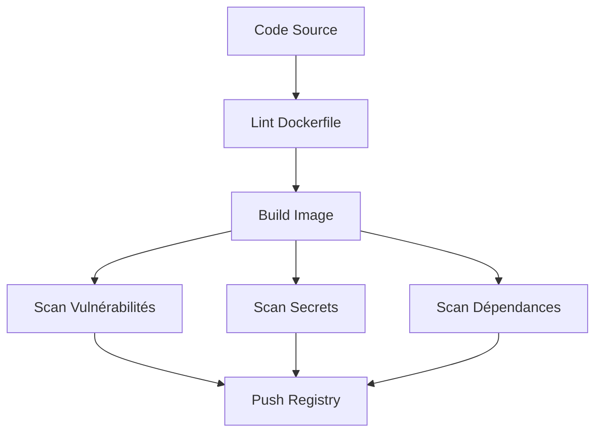

# Security Scanning Docker

Guide complet pour sécuriser vos pipelines Docker avec des scans automatisés.

## Vue d'ensemble



## Outils de scan

| Outil | Type | Usage |
|-------|------|-------|
| **Trivy** | Container/Dependencies | Scan complet des images |
| **TruffleHog** | Secrets | Détection de credentials |
| **Hadolint** | Dockerfile | Lint et best practices |
| **Snyk** | Container/Dependencies | Vulnérabilités avec remediation |
| **Bandit** | Python SAST | Analyse statique Python |
| **Semgrep** | Multi-langage SAST | Analyse statique universelle |

## Trivy - Scan de vulnérabilités

### Installation locale

```bash
# macOS
brew install trivy

# Docker
docker run aquasec/trivy image myapp:latest
```

### Scan d'une image

```bash
# Scan basique
trivy image myapp:latest

# Scan avec severité
trivy image --severity HIGH,CRITICAL myapp:latest

# Export JSON
trivy image --format json --output report.json myapp:latest

# Ignorer les vulnérabilités non corrigibles
trivy image --ignore-unfixed myapp:latest
```

### GitLab CI

```yaml
trivy-scan:
  stage: test
  image:
    name: aquasec/trivy:latest
    entrypoint: [""]
  script:
    - trivy image
        --exit-code 1
        --severity CRITICAL
        --ignore-unfixed
        ${CI_REGISTRY_IMAGE}:${CI_COMMIT_SHORT_SHA}
  allow_failure: true
  artifacts:
    reports:
      container_scanning: trivy-report.json
```

## TruffleHog - Détection de secrets

### Scan du repository

```bash
# Installation
pip install trufflehog

# Scan Git history
trufflehog git file://. --json > secrets.json

# Scan depuis un commit
trufflehog git file://. --since-commit abc123
```

### GitLab CI

```yaml
secrets-scan:
  stage: test
  image: trufflesecurity/trufflehog:latest
  script:
    - |
      trufflehog git file://. --json > secrets.json 2>/dev/null || true
      if grep -q "SourceMetadata" secrets.json; then
        echo "SECRETS DETECTED!"
        cat secrets.json | jq '.SourceMetadata'
        exit 1
      fi
```

## Hadolint - Lint Dockerfile

### Règles importantes

| Règle | Description |
|-------|-------------|
| DL3008 | Pin versions dans apt-get |
| DL3009 | Supprimer apt lists |
| DL3015 | Éviter apt-get install supplémentaires |
| DL3025 | Utiliser JSON pour CMD |
| DL4006 | Set SHELL pour pipefail |

### Configuration `.hadolint.yaml`

```yaml
ignored:
  - DL3008  # Ignorer pin versions apt
  - DL3013  # Ignorer pin versions pip

trustedRegistries:
  - docker.io
  - gcr.io

override:
  error:
    - DL3001  # Command invalide
  warning:
    - DL3042  # Cache pip
```

### GitLab CI

```yaml
dockerfile-lint:
  stage: lint
  image: hadolint/hadolint:latest-debian
  script:
    - hadolint Dockerfile
    - hadolint --config .hadolint.yaml docker/*.Dockerfile
```

## Scan des dépendances

### Python (Safety + pip-audit)

```yaml
python-deps-scan:
  stage: test
  image: python:3.12
  script:
    - pip install safety pip-audit bandit

    # Safety - CVE database
    - safety check --json > safety-report.json || true

    # pip-audit - PyPI advisories
    - pip-audit --format json > pip-audit-report.json || true

    # Bandit - SAST Python
    - bandit -r . -f json -o bandit-report.json || true
  artifacts:
    paths:
      - "*-report.json"
```

### Node.js (npm audit)

```yaml
node-deps-scan:
  stage: test
  image: node:20-alpine
  script:
    - npm audit --json > npm-audit.json || true
    - npx snyk test --json > snyk-report.json || true
  artifacts:
    paths:
      - "*-report.json"
```

## SAST avec Semgrep

### Règles de sécurité

```yaml
semgrep-scan:
  stage: test
  image: returntocorp/semgrep
  script:
    - semgrep --config=auto --json --output=semgrep.json .
    - |
      # Afficher les erreurs critiques
      cat semgrep.json | jq '.results[] | select(.extra.severity == "ERROR")'
  artifacts:
    reports:
      sast: semgrep.json
```

## Pipeline complet DevSecOps

```yaml
stages:
  - lint
  - build
  - security
  - deploy

# Lint Dockerfile
dockerfile-lint:
  stage: lint
  image: hadolint/hadolint:latest-debian
  script:
    - hadolint Dockerfile

# Build image
build:
  stage: build
  image:
    name: gcr.io/kaniko-project/executor:v1.14.0-debug
    entrypoint: [""]
  script:
    - /kaniko/executor
        --context "${CI_PROJECT_DIR}"
        --dockerfile Dockerfile
        --destination "${CI_REGISTRY_IMAGE}:${CI_COMMIT_SHORT_SHA}"

# Parallel security scans
trivy-scan:
  stage: security
  image:
    name: aquasec/trivy:latest
    entrypoint: [""]
  needs: ["build"]
  script:
    - trivy image --severity HIGH,CRITICAL
        ${CI_REGISTRY_IMAGE}:${CI_COMMIT_SHORT_SHA}

secrets-scan:
  stage: security
  image: trufflesecurity/trufflehog:latest
  needs: []
  script:
    - trufflehog git file://. --fail

deps-scan:
  stage: security
  image: python:3.12
  needs: []
  script:
    - pip install safety
    - safety check

sast-scan:
  stage: security
  image: returntocorp/semgrep
  needs: []
  script:
    - semgrep --config=auto .

# Deploy only if security passes
deploy:
  stage: deploy
  needs: ["trivy-scan", "secrets-scan", "deps-scan", "sast-scan"]
  script:
    - echo "Deploying secure image"
  when: manual
```

## Fichier de suppression Trivy

`.trivyignore` :

```
# Ignorer des CVE spécifiques
CVE-2023-12345
CVE-2023-67890

# Ignorer par package
pkg:npm/lodash@4.17.20
```

## Ressources

- [Trivy Documentation](https://aquasecurity.github.io/trivy/)
- [TruffleHog](https://github.com/trufflesecurity/trufflehog)
- [Hadolint](https://github.com/hadolint/hadolint)
- [Semgrep](https://semgrep.dev/)
- [OWASP Docker Security](https://cheatsheetseries.owasp.org/cheatsheets/Docker_Security_Cheat_Sheet.html)
