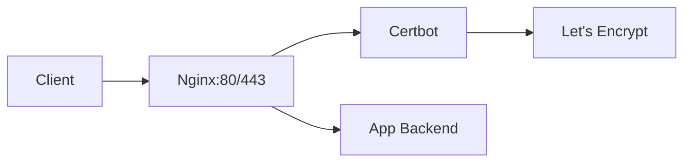

# Nginx + Certbot

Reverse proxy Nginx avec certificats SSL Let's Encrypt automatiques.

## Quick Start

```bash
cd nginx-certbot

# 1. Configurer le domaine dans nginx/conf.d/default.conf
# 2. Configurer init-letsencrypt.sh (domaine + email)

# 3. Initialiser le certificat
./init-letsencrypt.sh

# 4. Démarrer
docker compose up -d
```

## Ports

| Service | Port | Description |
|---------|------|-------------|
| HTTP | 80 | Redirection vers HTTPS |
| HTTPS | 443 | Trafic SSL |

## Architecture



## Fonctionnement

### Renouvellement automatique

- **Certbot** vérifie le renouvellement toutes les **12 heures**
- **Nginx** recharge sa configuration toutes les **6 heures**
- Certificats renouvelés automatiquement avant expiration

### Challenge ACME

```nginx
location /.well-known/acme-challenge/ {
    root /var/www/certbot;
}
```

## Configuration

### Variables

| Variable | Description |
|----------|-------------|
| `domains` | Liste des domaines |
| `email` | Email pour Let's Encrypt |
| `staging` | Mode test (évite rate limits) |

### Exemple proxy vers application

```nginx
server {
    listen 443 ssl;
    server_name app.example.com;

    ssl_certificate /etc/letsencrypt/live/app.example.com/fullchain.pem;
    ssl_certificate_key /etc/letsencrypt/live/app.example.com/privkey.pem;

    location / {
        proxy_pass http://app:8080;
        proxy_set_header Host $host;
        proxy_set_header X-Real-IP $remote_addr;
        proxy_set_header X-Forwarded-For $proxy_add_x_forwarded_for;
        proxy_set_header X-Forwarded-Proto $scheme;
    }
}
```

## Volumes

| Chemin | Description |
|--------|-------------|
| `./nginx/conf.d` | Configuration Nginx |
| `./certbot/conf` | Certificats SSL |
| `./certbot/www` | Challenge ACME |

## Mode Staging

Pour les tests, activez le mode staging :

```bash
# Dans init-letsencrypt.sh
staging=1
```

## Liens

- [Certbot](https://certbot.eff.org/)
- [Let's Encrypt](https://letsencrypt.org/)
