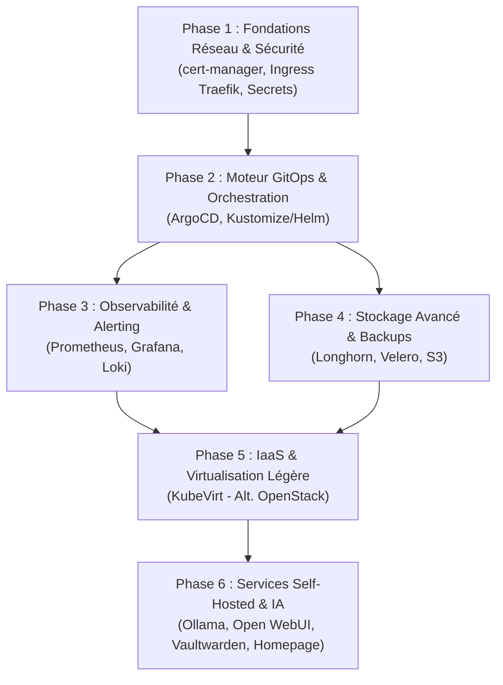

# Roadmap Homelab & Kubernetes K3s — Acemagic K1 Mini

Feuille de route pour l'enrichissement progressif et modulaire du cluster **K3s** sur le serveur **Acemagic K1 Mini** (4 cœurs / 8 vCPU, 32 Go RAM, 1 To SSD NVMe).

---

## 🧭 Vue d'ensemble des Phases

---

## 📌 Détail des Phases

### Phase 1 : Fondations Réseau & Sécurité TLS
> **Objectif** : Avoir des certificats TLS valides automatiques et sécuriser l'exposition des services.
- [ ] **cert-manager** :
  - Déploiement via Helm dans le namespace `cert-manager`.
  - Configuration du `ClusterIssuer` Let's Encrypt (DNS-01 via API Cloudflare ou HTTP-01).
- [ ] **IngressRoutes Traefik** :
  - Standardiser les règles d'Ingress Traefik (intégré à K3s) pour exposer les futurs services avec TLS automatique.
- [ ] **Gestion des Secrets** :
  - Mise en place de `Sealed Secrets` ou `External Secrets Operator` pour versionner les secrets de manière chiffrée dans Git.

---

### Phase 2 : Moteur GitOps & Déploiement Continu
> **Objectif** : Ne plus déployer manuellement via `kubectl apply`, mais piloter tout le cluster depuis Git.
- [ ] **ArgoCD** :
  - Déploiement dans le namespace `argocd`.
  - Exposition de l'UI Web ArgoCD via Ingress HTTPS.
  - Définition de l'arborescence de manifests dans `kubernetes/apps/` et `kubernetes/infrastructure/`.
- [ ] **Pattern App-of-Apps** :
  - Configuration d'une application racine ArgoCD qui gère automatiquement toutes les briques logicielles du homelab.
- [x] **In-Cluster Container Build (Kaniko)** :
  - Compilation d'images de conteneurs dans le cluster sans daemon Docker ni privilèges root (`userspace`).
  - Support du multi-stage build avec `uv` et mise en cache sur registre externe/interne.
  - Manifests disponibles dans `kubernetes/infrastructure/ci-cd/kaniko/`.

---

### Phase 3 : Observabilité & Monitoring
> **Objectif** : Suivre la charge CPU (8 vCPU), la consommation mémoire (32 Go) et les I/O du SSD 1 To.
- [ ] **Kube-Prometheus-Stack** :
  - Déploiement de Prometheus Operator, Alertmanager et Grafana via ArgoCD / Helm.
  - Configuration des dashboards officiels Kubernetes (Node Exporter, Cluster, Pods).
- [ ] **Loki + Promtail** (optionnel) :
  - Centralisation des logs conteneurs pour investigation rapide directement depuis Grafana.
- [ ] **Métriques Matérielles K1 Mini** :
  - Monitoring de la température CPU et de l'état NVMe SMART.

---

### Phase 4 : Stockage Persistant Avancé & Sauvegardes
> **Objectif** : Sécuriser les données d'état et permettre des snapshots réguliers.
- [ ] **Longhorn** (ou maintien de `local-path-provisioner`) :
  - Évaluation de Longhorn pour les snapshots programmés et la réplication de volumes sur SSD.
- [ ] **Sauvegardes Velero** :
  - Sauvegarde quotidienne automatique des configurations K3s et des PVCs vers un bucket S3 distant (MinIO externe ou Cloudflare R2).

---

### Phase 5 : Virtualisation Légère (KubeVirt — Alternative à OpenStack)
> **Objectif** : Fournir une capacité IaaS sans installer la lourdeur d'OpenStack-Ansible.
- [ ] **KubeVirt Operator & CRDs** :
  - Déploiement de l'opérateur KubeVirt sur K3s.
  - Activation de l'accélération matérielle KVM (`/dev/kvm`).
- [ ] **Tests de VMs Linux & Windows** :
  - Lancement d'instances virtuelles Ubuntu Cloud Image managées comme des pods Kubernetes.
  - Intégration dans le réseau virtuel via multus / bridges si nécessaire.

---

### Phase 6 : Services Self-Hosted & IA Locale
> **Objectif** : Déployer les applications métier et outils du quotidien.
- [ ] **IA Locale (CPU + 32 Go RAM)** :
  - **Ollama** + **Open WebUI** pour modèles LLM locaux (Mistral, Llama 3, Qwen).
- [ ] **Sécurité & Mots de passe** :
  - **Vaultwarden** (Bitwarden) avec stockage persistant et sauvegarde automatique.
- [ ] **Portail Homelab** :
  - **Homepage** : Dashboard central regroupant les accès à ArgoCD, Grafana, Open WebUI, K3s, et affichant les jauges de santé en temps réel.
