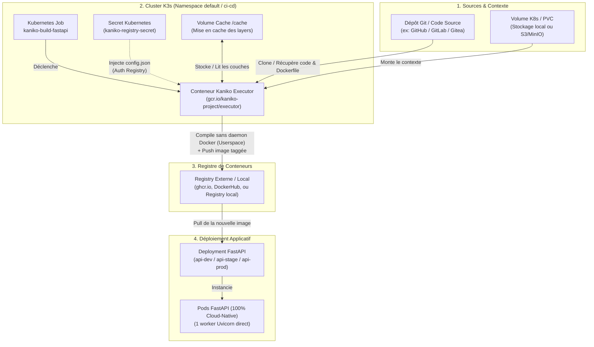

# 🚀 Kaniko — In-Cluster Container Image Builder (Rootless)

Ce module fournit une solution **100% Kubernetes-native et sécurisée** pour compiler des images de conteneurs directement au sein de votre cluster K3s sans nécessiter de daemon Docker, ni de socket `/var/run/docker.sock`, ni de conteneur en mode `privileged`.

---

## 🎯 Avantages Clés de Kaniko

1. **Sécurité Totale (Userspace / Rootless)** :
   - Kaniko s'exécute entièrement dans l'espace utilisateur du conteneur.
   - Aucun accès au daemon hôte n'est nécessaire (évite toute escalade de privilèges sur le serveur K1 Mini).
2. **Support des Dockerfiles Multi-Stage** :
   - Compatible avec les compilations modernes utilisant `uv`, `cargo`, `gcc`, etc.
3. **Mise en cache des couches** :
   - Flag `--cache=true` pour réutiliser les couches déjà compilées sur le registre et diviser par 5 le temps de build.
4. **Intégration GitOps & CI/CD** :
   - S'exécute sous forme de **Kubernetes `Job`**, déclenchable manuellement, via un `CronJob`, ou intégré à des pipelines (Tekton, Argo Workflows, GitHub Actions Self-Hosted).

---

## 🔄 Schéma du Workflow Kaniko dans le Homelab

Voici le cycle de vie complet d'un build in-cluster exécuté par Kaniko sur votre serveur K1 Mini :



### 🧩 Étapes détaillées du flux :

1. **Extraction du Contexte** :
   - Le Pod Kaniko démarre et télécharge le code source et le `Dockerfile` depuis votre dépôt Git (ou un volume partagé PVC/S3).
2. **Compilation Rootless en Espace Utilisateur** :
   - Kaniko extrait le système de fichiers de l'image de base (`python:3.11-slim-bookworm`).
   - Il exécute chaque instruction du `Dockerfile` (ex: `RUN uv sync --compile-bytecode`) directement dans son propre conteneur utilisateur.
   - Il calcule le snapshot des fichiers modifiés après chaque étape, sans jamais interagir avec le moteur de conteneur de l'hôte K3s (containerd).
3. **Mise en cache & Push** :
   - Grâce au volume de cache ou au registre de cache (`--cache=true`), les étapes répétitives (comme le téléchargement des packages Python) sont réutilisées.
   - Kaniko s'authentifie grâce au Secret Kubernetes monté dans `/kaniko/.docker/config.json` et pousse l'image finale sur le registre.
4. **Déploiement Continu** :
   - Le Deployment FastAPI (Dev/Staging/Prod) ou ArgoCD détecte la nouvelle image et effectue un Rolling Update instantané sur le cluster.

---

## 📁 Structure

```text
kubernetes/infrastructure/ci-cd/kaniko/
├── README.md                     # Le présent guide
├── kaniko-secret-template.yaml   # Template de secret d'authentification Registry
└── kaniko-job-template.yaml      # Job K8s pour exécuter le build Kaniko
```

---

## 🛠️ Guide d'Utilisation Pratique

### Étape 1 : Créer le Secret d'authentification Registry

Pour que Kaniko puisse pousser (*push*) l'image compilée sur votre registre (Docker Hub, GitHub Container Registry `ghcr.io` ou registre local privé) :

#### Exemple avec GitHub Container Registry (`ghcr.io`) :
```bash
kubectl create secret docker-registry kaniko-registry-secret \
  --docker-server=ghcr.io \
  --docker-username=<VOTRE_GITHUB_USERNAME> \
  --docker-password=<VOTRE_GITHUB_PAT_TOKEN> \
  --namespace=default
```

#### Exemple avec Docker Hub :
```bash
kubectl create secret docker-registry kaniko-registry-secret \
  --docker-server=https://index.docker.io/v1/ \
  --docker-username=<VOTRE_DOCKERHUB_USER> \
  --docker-password=<VOTRE_DOCKERHUB_TOKEN> \
  --namespace=default
```

---

### Étape 2 : Configurer la source du Contexte dans le Job

Dans le fichier [kaniko-job-template.yaml](file:///Volumes/X9%20Pro/Workspaces/nkaurelien/docker-examples/kubernetes/infrastructure/ci-cd/kaniko/kaniko-job-template.yaml), Kaniko peut récupérer le code source directement depuis :

1. **Un dépôt Git public ou privé** :
   ```yaml
   args:
     - "--context=git://github.com/nkaurelien/mon-projet.git#refs/heads/main"
     - "--context-sub-path=backend"
     - "--dockerfile=Dockerfile"
     - "--destination=ghcr.io/nkaurelien/fastapi-backend:v1.0.0"
     - "--cache=true"
   ```

2. **Un bucket S3 / MinIO** :
   ```yaml
   args:
     - "--context=s3://mon-bucket/context.tar.gz"
   ```

3. **Un Volume Persistant K8s (PVC)** :
   ```yaml
   args:
     - "--context=dir:///workspace"
   ```
   > ⚠️ `dir://` exige un volume **réellement peuplé** (PVC pré-rempli, ou init-container
   > qui clone le dépôt). Monté sur un `emptyDir`, le contexte est vide et le build échoue.

> 💡 **Cache** : préférez `--cache-repo=<registre>/<image>/cache` à `--cache-dir`.
> Un `--cache-dir` sur `emptyDir` disparaît avec le pod du Job : le cache n'est jamais
> réutilisé d'un build à l'autre, et le gain annoncé est nul.

---

### Étape 3 : Lancer le Build et Suivre les Logs

1. **Appliquer le Job** :
   ```bash
   kubectl apply -f kubernetes/infrastructure/ci-cd/kaniko/kaniko-job-template.yaml
   ```

2. **Suivre les logs de compilation en temps réel** :
   ```bash
   kubectl logs -f job/kaniko-build-fastapi
   ```

3. **Nettoyer après achèvement** :
   ```bash
   kubectl delete job kaniko-build-fastapi
   ```
   *(Le Job dispose également de `ttlSecondsAfterFinished: 600` pour un auto-nettoyage au bout de 10 minutes).*

---

## 🦩 Le Duo Parfait : Kaniko + Crane (Google go-containerregistry)

**Crane** est le couteau suisse officiel de Google pour interagir avec des registres de conteneurs distants **sans avoir besoin de Docker ni de daemon**.

Alors que **Kaniko** sert à **créer / compiler** des images, **Crane** sert à **inspecter, copier, retagger, scanner et valider** les images directement sur le registre distant à la vitesse de l'éclair (en manipulant uniquement les manifests et couches HTTP, sans jamais télécharger l'image entière sur votre machine locale).

### Comparatif des Rôles : Kaniko vs Crane

| Outil | Rôle Principal | Opérations Clés |
| :--- | :--- | :--- |
| **Kaniko** | **Builder (Constructeur)** | Lit le Dockerfile, exécute `RUN`, compile avec `uv`, assemble les couches et pousse l'image initiale. |
| **Crane** | **Manager / Mover (Opérateur)** | Retagging instantané (`staging` $\rightarrow$ `prod`), copie inter-registres, inspection des manifests OCI, extraction de digests. |

```mermaid
flowchart LR
    GitSource["Code Source"] -->|"1. Build & Push v1.0.0"| Kaniko["Kaniko (K8s Job)"]
    Kaniko -->|"2. Push initial"| GHCR["ghcr.io (Staging)"]
    GHCR -->|"3. Crane copy / tag"| Crane["Crane CLI / Pod"]
    Crane -->|"4. Promotion instantanée sans rebuild"| ProdReg["Registry Prod / Local"]
    ProdReg -->|"5. Déploiement"| K8sProd["Cluster Prod Pods"]
```



### Cas d'Usage Incontournables de Crane dans votre Homelab

#### 1. Promotion d'image instantanée (Zero Rebuild)
Pour promouvoir une image validée en Staging vers la Production, Crane modifie simplement le tag sur le registre distant **en 200 millisecondes**, sans retélécharger l'image ni la recompiler :
```bash
crane tag ghcr.io/kamitbrains/fastapi-api:staging-commit-abc v1.0.0
```

#### 2. Copier une image d'un registre public vers votre registre local (Air-Gap / Cache)

La commande suit la convention standard UNIX (`cp <source> <destination>`) :

```bash
crane copy <SOURCE> <DESTINATION>

# Exemple concret :
crane copy couchdb:3.4 ghcr.io/kamitbrains/couchdb:3.4
#          ^^^^^^^^^^^ ^^^^^^^^^^^^^^^^^^^^^^^^^^^^^^
#            SOURCE                 DESTINATION
```

- **SOURCE (`couchdb:3.4`)** : Image d'origine. En l'absence de domaine, pointe vers **Docker Hub** officiel (`index.docker.io/library/couchdb:3.4`).
- **DESTINATION (`ghcr.io/kamitbrains/couchdb:3.4`)** : Registre cible distant (**GitHub Container Registry**, dans le compte/orga `kamitbrains`).

> 💡 **Avantage clé** : Contrairement à Docker (`docker pull` puis `docker push`), le transfert s'effectue **directement de registre à registre en streaming HTTP** côté réseau, sans jamais télécharger l'image (couches et gigaoctets) sur le disque dur de votre Mac !

#### 3. Inspecter le Manifeste OCI, les Layers et la taille réelle
Voir l'architecture CPU (amd64/arm64), la taille et les variables d'environnement d'une image sans la télécharger :
```bash
crane manifest ghcr.io/kamitbrains/fastapi-api:latest | jq .
crane config ghcr.io/kamitbrains/fastapi-api:latest | jq .config.Env
```

#### 4. Obtenir le SHA256 Digest immuable pour Kubernetes
En production Kubernetes, il est recommandé de figer l'image par son SHA256 plutôt que le tag `:latest` :
```bash
crane digest ghcr.io/kamitbrains/fastapi-api:latest
# Sortie : sha256:4a2f1b88e...
```

#### 5. Installer Crane sur Mac
```bash
brew install crane
```
